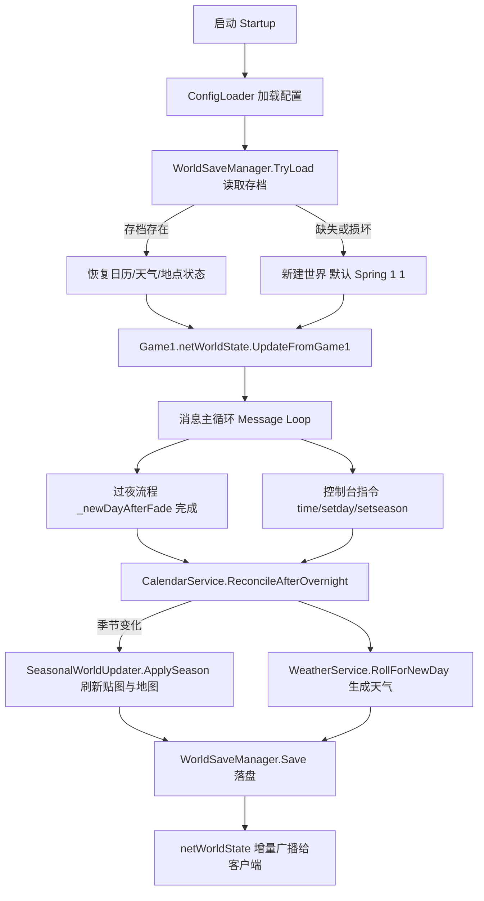

# 季节玩法（season-gameplay）技术设计

Feature Name: 2026-09-30-season-gameplay
Updated: 2026-09-30

## 描述

本设计在 ValleyServer 3.x 无头服务端上实现完整季节玩法逻辑，覆盖需求 1–7：日历自动推进与跨季、日历同步、日历与农场世界持久化、季节视觉切换、作物生长与跨季生命周期、天气模拟、运维控制与配置。

当前实现只把日历硬编码为「第 1 年 · 春 · 1 日」（`src/ValleyServer/Program.cs:311-313`），并在过夜结束后重置时间（`src/ValleyServer/Program.Helpers.cs:531`），没有任何季节推进校验、季节视觉刷新、天气生成或世界存档。世界状态仅通过 `Game1.netWorldState.Value.UpdateFromGame1()`（`src/ValleyServer/Program.cs:477`、`src/ValleyServer/Program.cs:1066`）同步给客户端；存档只包含 farmhand 的 XML（`src/ValleyServer/Program.Helpers.cs:608-645`），不含日历与农场世界。

设计原则：**复用原版逻辑，仅在无头环境缺失的环节补齐**。日历推进、天气生成、作物日更新、季节贴图切换在原版 DLL 中均已存在（`seasonUpdate`、`UpdateWeatherForNewDay`、`DayUpdate`、`updateSeasonalTileSheets`），因此服务端以「观察 + 补齐 + 持久化」为主，避免重写游戏规则。

## 架构



### 关键注入点

| 环节 | 现有位置 | 本设计的动作 |
| :--- | :--- | :--- |
| 世界初始化 | `src/ValleyServer/Program.cs:304-320` | 用配置的起始日期替换硬编码的 `Season.Spring` / `dayOfMonth = 1` / `year = 1` |
| 过夜完成 | `src/ValleyServer/Program.Helpers.cs:474-520` | 协程返回后调用 `CalendarService.ReconcileAfterOvernight`、`SeasonalWorldUpdater`、`WeatherService`、`WorldSaveManager.Save` |
| 世界同步 | `src/ValleyServer/Program.cs:477`、`1066` | 保持 `UpdateFromGame1`，确保日历/天气字段参与增量广播 |
| 地点日更新 | `src/ValleyServer/Program.Helpers.cs:181-209` | 校验过夜时 `GameLocation.DayUpdate` 是否执行，缺失则显式补齐 |
| 启动加载存档 | `src/ValleyServer/Program.cs:480-484` | 在 `LoadSavedFarmhands` 之后加载世界存档并同步给客户端 |
| 优雅退出 | `src/ValleyServer/Program.Shutdown.cs:53-81` | 在保存 farmhand 之后调用 `WorldSaveManager.Save` |

## 组件与接口

### 1. CalendarService（新增 `CalendarService.cs`）

负责日历的读取、规范化、推进观察与日期设置。

```csharp
public readonly record struct CalendarSnapshot(int Year, int SeasonIndex, int DayOfMonth);

public interface ICalendarService
{
    CalendarSnapshot Current { get; }
    // 在过夜协程返回后调用：校验并规范化日历，返回是否发生季节切换。
    bool ReconcileAfterOvernight(out CalendarSnapshot previous, out CalendarSnapshot current);
    // 运维指令：直接设置日期。
    void SetDate(int year, int seasonIndex, int dayOfMonth);
    // 运维指令：原地推进 N 天（不触发过夜，仅用于调试）。
    void AdvanceDays(int days);
    // 起始日期来自配置。
    void InitializeFromConfig();
}
```

行为要点：

- `ReconcileAfterOvernight` 读取 `Game1.year`、`Game1.seasonIndex`、`Game1.dayOfMonth`，强制满足 `1 <= DayOfMonth <= 28`、`0 <= SeasonIndex <= 3`、`Year >= 1`。
- 若原版已正确推进（正常路径），本方法只做校验与日志；若发现越界（例如日推进缺失），按 28 天 / 4 季规则补齐。
- 季节切换时触发 `SeasonChanged` 事件，由 `SeasonalWorldUpdater` 订阅。

### 2. SeasonalWorldUpdater（新增 `SeasonalWorldUpdater.cs`）

负责季节视觉与地图切换（需求 4）。

```csharp
public interface ISeasonalWorldUpdater
{
    void ApplySeason(Season season);
    void ApplySeasonForLocation(GameLocation location, Season season);
}
```

行为要点：

- 遍历 `Game1.locations`，对每个地点调用原版 `GameLocation.seasonUpdate(...)` 与 `GameLocation.updateSeasonalTileSheets(...)`。
- 复用现有 `HeadlessDisplayDevice`（`src/ValleyServer/HeadlessDisplayDevice.cs`）作为 `xTile` 显示后端。
- 优先订阅原版 `Game1.OnNewSeason` 事件；若事件不可用，则由 `CalendarService.SeasonChanged` 驱动。
- 对 `SeasonOffset` / `seasonOverride` / `IgnoresSeasonsHere` 的地点保持不变。

### 3. CropDayUpdater（并入 `SeasonalWorldUpdater.cs` 或独立）

负责作物生长与跨季生命周期（需求 5）。

```csharp
public interface ICropDayUpdater
{
    void RunDayUpdate(int dayOfMonth);
    void ApplySeasonTransition(Season previous, Season current);
}
```

行为要点：

- 过夜时对每个 `GameLocation` 调用原版日更新路径（`GameLocation.DayUpdate`）。若原版协程在无头分支下跳过了某地点，显式调用补齐。
- 跨季时对非当季作物应用原版枯萎 / 死亡结果；对多季 / 再生作物应用原版存活与再生规则（由原版 `HoeDirt` / `Crop` 逻辑承担，服务端只保证触发）。
- 依赖 `Game1.cropData`（已在 `src/ValleyServer/Program.cs:371` 加载）。

### 4. WeatherService（新增 `WeatherService.cs`）

负责天气生成与同步（需求 6）。

```csharp
public readonly record struct WeatherSnapshot(
    bool IsRaining, bool IsSnowing, bool IsLightning, bool IsDebrisWeather,
    int WeatherForTomorrow, int WeatherIcon);

public interface IWeatherService
{
    WeatherSnapshot Current { get; }
    void RollForNewDay();
    void PromoteTomorrowToToday();
    void SyncToNetWorldState();
}
```

行为要点：

- 复用原版 `Game1.netWorldState.Value.UpdateWeatherForNewDay()` 按季节与种子生成天气；服务端不重写概率表。
- 确定性：天气由 `Game1.uniqueIDForThisGame`（`src/ValleyServer/Program.cs:308-310`）与日期共同决定，相同种子 + 相同日期得到相同结果。
- 降水天气（`isRaining` / `isSnowing`）由原版逻辑把室外土壤标记为已浇水；服务端保证该更新在昼夜推进时执行。
- `SyncToNetWorldState` 调用 `UpdateFromGame1` 让增量广播携带天气字段。

### 5. WorldSaveManager（新增 `WorldSaveManager.cs`）

负责日历与农场世界持久化（需求 3）。

```csharp
public interface IWorldSaveManager
{
    bool TryLoad();
    void Save();
    string SavePath { get; }
}
```

行为要点：

- 元数据文件 `<SaveDirectory>/world.json`（`System.Text.Json`），含版本、日历、天气。
- 地点状态文件 `<SaveDirectory>/locations/<SanitizedName>.xml`，复用原版 `SaveSerializer.GetSerializer(typeof(GameLocation))`，与现有 farmhand 存档方式一致（`src/ValleyServer/Program.Helpers.cs:579`）。
- 加载顺序：先构造新的原版世界（`Game1.AddLocations()`），再逐地点反序列化并替换 `Game1.locations` 中的实例，最后 `Game1.flushLocationLookup()` 与 `UpdateFromGame1`。
- 元数据带 `Version` 字段；低版本存档用兼容默认值补齐。
- 写入采用「临时文件 + 原子替换」，与现有 `SaveFarmhand` 一致（`src/ValleyServer/Program.Helpers.cs:615-625`）。

### 6. 配置扩展（修改 `ServerConfig.cs` / `ConfigLoader.cs`）

```csharp
public sealed class WorldSection
{
    // 新增
    public int StartingYear { get; set; } = 1;
    public int StartingSeason { get; set; } = 0;   // 0=Spring..3=Winter
    public int StartingDayOfMonth { get; set; } = 1;
    public bool PersistWorld { get; set; } = true;
}
```

### 7. 控制台指令（修改 `Program.Commands.cs`）

| 指令 | 作用 |
| :--- | :--- |
| `time` | 输出当前 `year/season/day` 与天气 |
| `setday <1-28>` | 设置当前季节内的日期 |
| `setseason <spring\|summer\|fall\|winter>` | 切换季节并触发视觉刷新 |
| `advance [days]` | 原地推进 N 天（默认 1），用于调试与快速验证 |

## 数据模型

### world.json

```json
{
  "version": 1,
  "year": 1,
  "seasonIndex": 0,
  "dayOfMonth": 1,
  "weatherForTomorrow": 0,
  "isRaining": false,
  "isSnowing": false,
  "isLightning": false,
  "isDebrisWeather": false,
  "weatherIcon": 0,
  "locations": ["Farm", "FarmHouse", "Town", "Town-1"]
}
```

### 日历状态映射

| 设计字段 | 原版来源 |
| :--- | :--- |
| `Year` | `Game1.year` |
| `SeasonIndex` | `Game1.seasonIndex`，`Season` 枚举 0–3 |
| `DayOfMonth` | `Game1.dayOfMonth` |
| 存档别名 | `NetWorldState.dayOfMonthForSaveGame` / `seasonForSaveGame` / `yearForSaveGame` |

### 天气状态映射

| 设计字段 | 原版来源 |
| :--- | :--- |
| `IsRaining` / `IsSnowing` / `IsLightning` / `IsDebrisWeather` | `NetWorldState.isRaining` 等 |
| `WeatherForTomorrow` | `NetWorldState.weatherForTomorrow` |
| `WeatherIcon` | `NetWorldState.weatherIcon` |

## 正确性属性

1. **日历不变量**：任意时刻满足 `1 <= DayOfMonth <= 28`、`0 <= SeasonIndex <= 3`、`Year >= 1`。
2. **单日推进**：一次成功的过夜流程后日期恰好前进 1 天；跨季边界前进到 `DayOfMonth = 1` 且 `SeasonIndex` 递增；冬季边界递增 `Year` 并回到春季。
3. **视觉一致性**：季节切换后每个受季节影响的地点的季节贴图与当前季节一致。
4. **天气一致性**：`Game1` 天气字段与 `Game1.netWorldState` 中的天气快照在广播前相等。
5. **确定性**：相同 `uniqueIDForThisGame` 与相同日期生成相同天气。
6. **存档往返**：写入后读回得到与写入前相同的日历、天气与地点状态。
7. **季节内容产物**：跨季作物处理只发生一次，重复执行不改变结果（幂等）。

## 错误处理

| 场景 | 处理策略 |
| :--- | :--- |
| 世界存档缺失 | 用配置的起始日期与新建世界初始化，输出警告日志 |
| 世界存档损坏 / 反序列化异常 | 保留现场世界运行，日志记录失败地点，标记存档为可重建 |
| 单个地点加载失败 | 跳过该地点并保留原版新建实例，避免整体启动失败 |
| 反射目标缺失（游戏升级） | 记录缺失成员名并降级为「仅日历推进」，不影响服务器可用性 |
| 天气生成方法不可用 | 回退为按季节默认天气（晴），并输出警告 |
| 运维指令参数非法 | 拒绝执行并输出用法，保持日历不变 |

## 测试策略

1. **单元测试（纯逻辑）**：`CalendarService` 的 28 天 / 4 季 / 年递增边界；`AdvanceDays` 跨季；非法日期拒绝。
2. **序列化往返测试**：`world.json` 元数据与 `GameLocation` XML 的写入 → 读回一致性（对应需求 3 的往返验收标准）。
3. **无头自检**：仿照现有 `RunDebrisSelfTest`（`src/ValleyServer/Program.Helpers.cs:96-175`）添加 `RunSeasonSelfTest`：推进 28 天，断言季节切换、作物状态与贴图刷新被触发。
4. **天气确定性测试**：固定 `uniqueIDForThisGame` 与日期，重复 `RollForNewDay` 结果一致。
5. **端到端**：启动无头服务端并连接真实客户端，验证客户端 HUD 日期 / 天气与服务端一致，跨夜后正确前进。
6. **回归**：确保过夜屏障流程（`Program.Helpers.cs:429-542`）与 farmhand 存档（`Program.Helpers.cs:608-645`）不受影响。

## 实施顺序

1. 配置扩展 + `CalendarService`（含边界与单元测试）。
2. 过夜注入点接线 + 日志。
3. `WeatherService` + 同步。
4. `SeasonalWorldUpdater` + `CropDayUpdater`。
5. `WorldSaveManager`（先日历元数据，再地点状态）。
6. 控制台指令 + `RunSeasonSelfTest`。
7. 端到端联机验证。

## 参考资料

[^1]: (`src/ValleyServer/Program.cs#L304-L320`) - [世界初始化与硬编码日历](src/ValleyServer/Program.cs)
[^2]: (`src/ValleyServer/Program.Helpers.cs#L429-L542`) - [无头过夜协程泵](src/ValleyServer/Program.Helpers.cs)
[^3]: (`src/ValleyServer/Program.Helpers.cs#L608-L645`) - [现有 farmhand 存档实现](src/ValleyServer/Program.Helpers.cs)
[^4]: (`src/ValleyServer/ServerConfig.cs#L54-L90`) - [世界与模拟配置段](src/ValleyServer/ServerConfig.cs)
[^5]: (`docs/v3/README.md#L89-L100`) - [3.x 当前进度与已知限制](docs/v3/README.md)
[^6]: (`src/ValleyServer/deps/Stardew Valley.dll`) - [原版成员：seasonUpdate / UpdateWeatherForNewDay / updateSeasonalTileSheets / dayOfMonthForSaveGame / seasonForSaveGame / yearForSaveGame](src/ValleyServer/deps)
